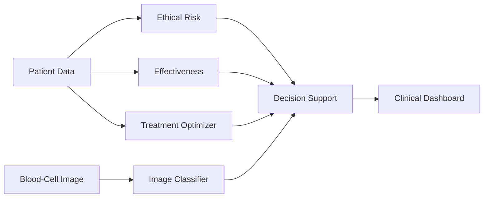
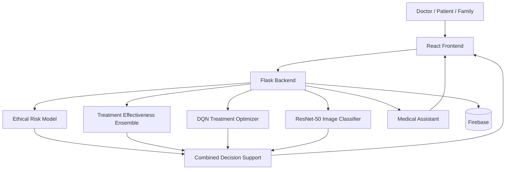
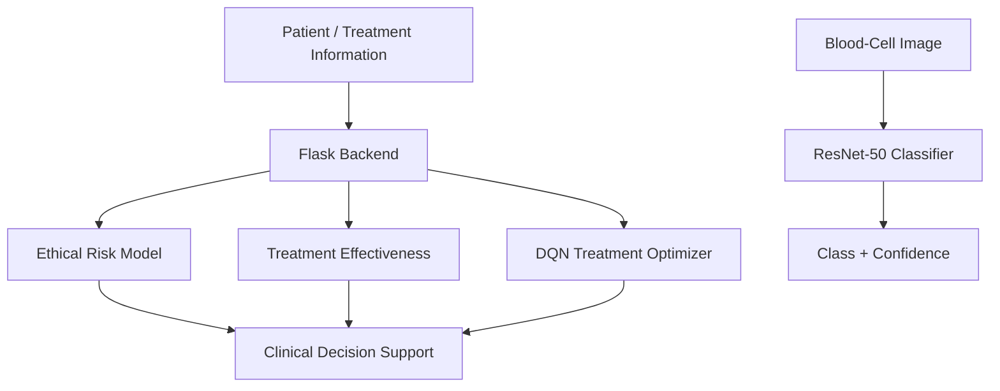
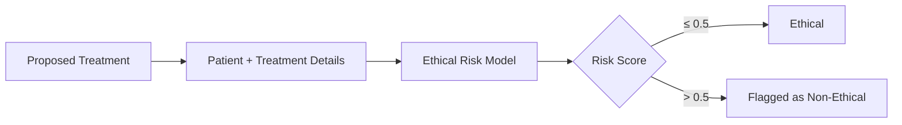
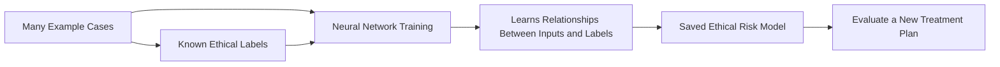
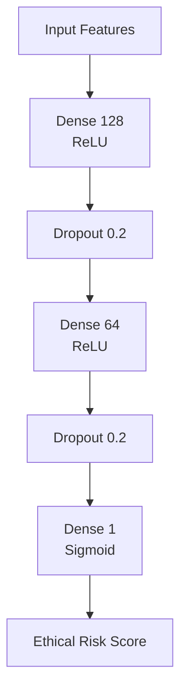
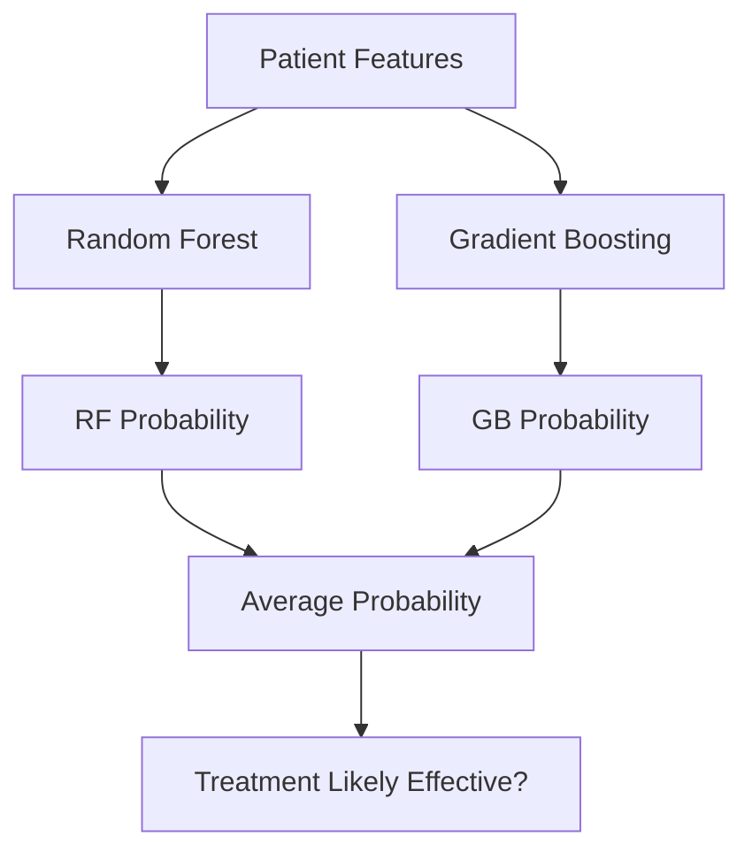
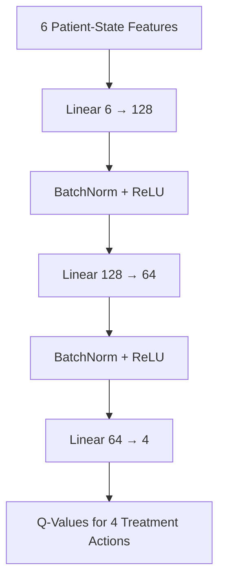
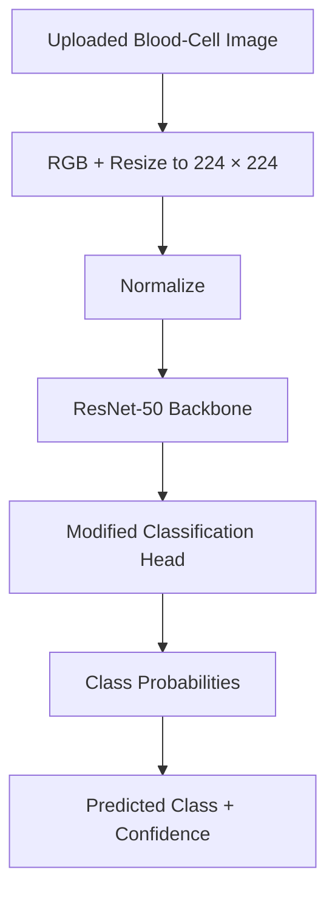
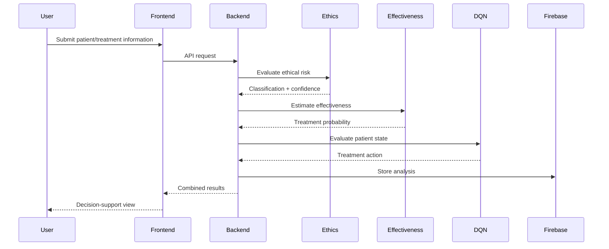

# LeukemiaCare

> **AI-assisted decision support for equitable, transparent, and ethically informed leukemia care.**

LeukemiaCare is a research prototype that brings **ethical risk analysis, treatment-effectiveness prediction, reinforcement-learning-based treatment recommendation, leukemia image classification, and conversational assistance** into a single clinical decision-support platform.

The system is designed to **support clinical decision-making, not replace clinicians or professional medical judgment**.

---

## Overview

Leukemia treatment decisions involve more than predicting whether a therapy may work. Clinicians must also consider patient consent, treatment burden, safety, financial impact, guideline compliance, disease progression, and quality of life.

LeukemiaCare explores how multiple AI models can work together to support this decision process.

The platform can:

- evaluate whether a proposed treatment raises ethical concerns,
- estimate the probability that a treatment will be effective,
- recommend a treatment action from the patient's clinical state,
- classify leukemia-related blood-cell images,
- provide healthcare-oriented conversational assistance,
- store patient, appointment, and analysis information,
- and present results through doctor- and family-facing interfaces.

### At a Glance



Each model has one clear responsibility, making the system easier to interpret, test, and improve independently.

---

## Key Features

| Component | Purpose | Technology |
|---|---|---|
| Ethical Risk Analysis | Flags potentially non-ethical treatment plans | Keras MLP |
| Treatment Effectiveness | Estimates treatment effectiveness probability | Random Forest + Gradient Boosting |
| Treatment Recommendation | Selects a treatment action from patient state | PyTorch DQN |
| Image Classification | Classifies leukemia-related blood-cell images | ResNet-50 |
| Medical Assistant | Provides healthcare-oriented conversational support | Gemini / LLM |
| Application Backend | Serves inference and application APIs | Flask |
| Frontend | Provides clinical and patient-facing workflows | React / React Router |
| Data Layer | Stores application and analysis data | Firebase Realtime Database |

---

## System Architecture



### Decision Flow



---

# AI Models

LeukemiaCare contains several models with separate responsibilities rather than relying on one model for the entire decision process.

## 1. Ethical Risk Model

**Location:** `backend/urvi/`

The ethical risk model evaluates whether a proposed treatment plan should be flagged as:

- **Ethical**
- **Non-Ethical**

### Inputs

The model considers features including:

- treatment type,
- dosage,
- patient age,
- leukemia stage,
- previous treatment history,
- patient consent,
- financial burden,
- medical-guideline compliance,
- overtreatment risk.

### How It Works in Simple Terms

Think of this model as a **warning system for a proposed treatment plan**.

A doctor or user provides information about the patient and the treatment being considered. The model does not simply ask, *"Will this treatment work?"* It also looks at factors that can make a treatment decision ethically concerning, such as whether the patient has consented, whether the treatment creates excessive burden, whether it follows represented medical guidelines, and whether there is a high risk of overtreatment.



For example, imagine two otherwise similar treatment plans. If one has patient consent, follows the represented guidelines, and has a low overtreatment risk, while another lacks consent or carries a high overtreatment risk, the second plan contains patterns that the model has learned to associate with a higher ethical-risk score.

### Why This Approach Works

The important idea is that **ethical concerns are represented as measurable input factors** rather than being left as an unexplained final label.

During training, the model sees many combinations of treatment and patient information together with their generated ethical labels. It gradually learns which combinations are associated with an ethical or non-ethical outcome.

In simplified form:



The neural network is useful here because several factors can matter **at the same time**. Instead of checking only one field independently, it can learn relationships across the complete input pattern.

For instance:

- **Consent** represents whether the patient has agreed to the treatment.
- **Guideline compliance** represents whether the proposed plan follows the rules encoded in the dataset.
- **Overtreatment risk** helps identify potentially excessive intervention.
- **Financial burden** introduces a socio-economic dimension.
- **Age, disease stage, dosage, and treatment history** provide context around the proposed treatment.

The model converts these factors into a single score between `0` and `1`. In the current implementation, a score above `0.5` is classified as **Non-Ethical**, while a score at or below `0.5` is classified as **Ethical**.

> **Important:** the current model learns from **synthetically generated labels based on predefined rules**. Therefore, it demonstrates how ethical factors can be incorporated into an AI decision-support pipeline; it does not prove that the model can determine medical ethics in real clinical practice. Real-world use would require clinically and ethically validated data, expert review, and extensive testing.

### Training Data

The current implementation generates a synthetic leukemia-treatment dataset of approximately **1,000 records**.

The target label is generated from predefined ethical conditions. A treatment is marked non-ethical when conditions such as the following occur:

- patient consent is missing,
- overtreatment risk is high,
- or guideline compliance is low.

Because these labels are synthetically generated, this component demonstrates the **architecture of an ethical decision-support system** rather than a clinically validated ethics model.

### Preprocessing

The training pipeline:

1. generates the synthetic treatment dataset,
2. one-hot encodes categorical variables,
3. splits the data into training and testing sets,
4. standardizes numerical features using `StandardScaler`,
5. trains the neural network,
6. saves the trained model and scaler.

### Architecture



The current inference rule is:

```text
score > 0.5  -> Non-Ethical
score <= 0.5 -> Ethical
```

### Inference Pipeline

`backend/urvi/app.py`:

1. receives treatment information as JSON,
2. converts the input into a pandas DataFrame,
3. performs the required categorical encoding,
4. restores missing training columns,
5. orders features according to the training representation,
6. applies the saved scaler,
7. performs neural-network inference,
8. returns the ethical classification and confidence score.

### Files

```text
backend/urvi/
├── app.py
├── model.py
├── ethical_violation_classifier.h5
├── scaler.pkl
└── synthetic_leukemia_treatment_dataset.csv
```

---

## 2. Treatment Effectiveness Ensemble

**Location:** `backend/vidit/treatment_prediction/`

This component estimates whether a treatment is likely to be effective for a patient.

The implementation combines two models:

- **Random Forest**
- **Gradient Boosting**

Instead of relying on either classifier independently, their predicted probabilities are averaged.

### Example Features

The effectiveness pipeline can include indicators such as:

- ANC mean,
- platelet mean,
- ANC stability,
- platelet stability,
- previous therapy response,
- patient profile,
- treatment burden,
- demographic or cohort variables.

### Prediction Flow



The `/api/effectiveness` endpoint:

1. creates an input row using the stored feature names,
2. inserts the provided patient values,
3. obtains the positive-class probability from each model,
4. averages the probabilities,
5. returns the individual and combined predictions.

Example response fields include:

```json
{
  "rf_probability": 0.0,
  "gb_probability": 0.0,
  "avg_probability": 0.0,
  "likely_effective": false
}
```

### Model Files

```text
backend/vidit/treatment_prediction/models/
├── rf_model.joblib
├── gb_model.joblib
└── feature_names.pkl
```

---

## 3. DQN Treatment Optimizer

The Deep Q-Network provides a reinforcement-learning-inspired treatment recommendation.

### State Representation

The model receives six numerical state variables:

1. WBC count
2. ANC
3. platelet count
4. hemoglobin
5. disease stage
6. survival probability

### Network Architecture



### Available Actions

The four output actions represent:

| Action | Treatment |
|---:|---|
| 0 | No Treatment |
| 1 | Chemotherapy |
| 2 | Targeted Therapy |
| 3 | Bone Marrow Transplant |

### Inference

The `/dqn_predict` endpoint:

1. converts the patient state into a PyTorch tensor,
2. performs a forward pass,
3. calculates the four Q-values,
4. selects the action with the largest Q-value using `argmax`,
5. maps the action to its corresponding treatment,
6. returns the recommendation.

The prototype also contains simple reward logic based on whether the selected treatment corresponds to the expected treatment for a disease stage.

> This is a prototype decision policy and is **not a clinically validated autonomous treatment optimizer**.

---

## 4. Leukemia Image Classifier

The image-analysis component processes uploaded blood-cell or leukemia-related images.

It is based on **ResNet-50** with a modified final classification layer.

### Current Classes

The model predicts categories such as:

- Benign
- `[Malignant] early Pre-B`
- `[Malignant] Pre-B`
- `[Malignant] Pro-B`

### Architecture



### Image Preprocessing

The inference pipeline:

1. reads the uploaded image,
2. converts it to RGB,
3. resizes it to `224 x 224`,
4. converts it into a tensor,
5. normalizes it using ImageNet-style statistics,
6. passes it through ResNet-50,
7. returns the predicted class and class probabilities.

Example output information includes:

```text
prediction
probability dictionary
sorted probabilities
```

---

## 5. Generative AI Medical Assistant

LeukemiaCare also includes a conversational healthcare assistant.

Its role is primarily informational. It can:

- receive healthcare-related questions,
- maintain short conversational context,
- apply system-level response guardrails,
- and return healthcare-oriented responses.

The assistant is connected to a **Gemini-based LLM integration** in the combined backend.

It is not intended to independently diagnose disease or determine treatment.

---

# Frontend

The frontend is located under:

```text
frontend/realsite/
```

Important application routes include:

```text
app/routes/doctor.tsx
app/routes/family.tsx
app/routes/appointments.tsx
app/routes/patients_new.tsx
```

The frontend provides interfaces for:

- doctor dashboards,
- family-facing information,
- patient treatment forms,
- appointment scheduling,
- treatment analysis,
- image upload and classification,
- conversational assistance,
- and case-review timelines.

The application communicates with the Flask services, currently using a local backend such as:

```text
http://localhost:5000
```

---

# Data Flow

A simplified treatment-analysis workflow is:



---

# Repository Structure

```text
LuekaemiaCare/
├── README.md
│
├── backend/
│   ├── manya/
│   │   ├── main_app.py
│   │   └── DQN_model.pth
│   │
│   ├── saved_models/
│   │   ├── ethical_violation_classifier.h5
│   │   ├── feature_names.pkl
│   │   ├── gb_model.joblib
│   │   ├── rf_model.joblib
│   │   └── scaler.pkl
│   │
│   ├── urvi/
│   │   ├── app.py
│   │   ├── model.py
│   │   ├── ethical_violation_classifier.h5
│   │   ├── scaler.pkl
│   │   └── synthetic_leukemia_treatment_dataset.csv
│   │
│   └── vidit/
│       ├── image_detect/
│       │   └── app.py
│       │
│       └── treatment_prediction/
│           ├── DQN_model.pth
│           ├── final_combined_app.py
│           ├── models/
│           ├── treatment_effectiveness_model.py
│           └── ...
│
└── frontend/
    └── realsite/
        ├── app/
        ├── Dockerfile
        ├── package.json
        ├── final_combined_app.py
        └── ...
```

---

# Getting Started

## Prerequisites

The project contains both Python and JavaScript components.

You will need:

- Python
- `pip`
- Node.js
- `npm`
- the required trained model files
- the appropriate Firebase configuration
- any required API credentials for external AI services

> Exact compatible runtime versions are not specified in the current project documentation. Check the repository dependencies before deploying into a clean environment.

---

## 1. Clone the Repository

```bash
git clone <repository-url>
cd LuekaemiaCare
```

Replace `<repository-url>` with the actual Git repository URL.

---

## 2. Start the Backend

The primary combined backend is located in:

```text
backend/vidit/treatment_prediction/
```

Run:

```bash
cd backend/vidit/treatment_prediction
pip install -r requirements.txt
python final_combined_app.py
```

The application expects the required model checkpoints and configuration files to exist at the paths referenced by the backend.

---

## 3. Start the Frontend

From the project root:

```bash
cd frontend/realsite
npm install
npm run dev
```

Open the local URL printed by the development server.

---

## Standalone Model Services

Individual components can also be run separately where their dependencies and model files are available.

### Ethical Risk Service

```bash
python backend/urvi/app.py
```

### DQN Service

```bash
python backend/manya/main_app.py
```

### Image Classification Service

```bash
python backend/vidit/image_detect/app.py
```

---

# Core Design Philosophy

LeukemiaCare is built around the idea that clinical decision support should consider more than model accuracy.

The prototype explores six important dimensions:

### Clinical Effectiveness

Is the proposed treatment likely to produce the intended outcome?

### Patient Autonomy

Has the patient consented to the proposed treatment?

### Treatment Safety

Does the recommendation introduce excessive treatment or clinical burden?

### Guideline Compliance

Does the treatment satisfy the constraints represented by the system?

### Socio-Economic Impact

Could financial burden materially affect the treatment decision?

### Quality of Life

Treatment decisions should account for patient impact rather than optimizing only for a predicted clinical outcome.

This multi-model architecture separates these concerns instead of hiding all reasoning inside a single black-box prediction.

---

# Current Limitations

LeukemiaCare is currently a **research and demonstration prototype**.

Important limitations include:

- the ethical classifier is trained on synthetic data,
- its ethical labels are generated from predefined rules,
- the treatment-effectiveness models rely on generated or cohort-oriented data,
- the DQN implements a prototype decision policy rather than a clinically validated treatment policy,
- the image classifier depends on locally available model checkpoints,
- several components depend on local paths and configuration,
- the frontend currently references local backend URLs,
- external API and Firebase configuration may require manual setup,
- model outputs have not been established as clinically valid recommendations,
- and the complete system has not been validated as a medical device.

These limitations are particularly important because strong performance on experimental datasets does **not** establish clinical safety or effectiveness.

---

# Safety and Responsible Use

> **LeukemiaCare must not be used as a substitute for professional medical judgment, diagnosis, or treatment.**

Any future clinical deployment would require substantially more validation than the current research prototype provides.

At minimum, a production system would need:

- validation using representative clinical datasets,
- independent clinical evaluation,
- bias and subgroup-performance analysis,
- privacy and data-protection controls,
- secure credential and secret management,
- model and dataset versioning,
- audit logging,
- uncertainty handling,
- explainability appropriate for clinicians,
- human review of recommendations,
- regulatory assessment,
- and continuous safety monitoring.

All treatment-related outputs should be reviewed by appropriately qualified healthcare professionals.

---

# Privacy and Security

Medical applications handle highly sensitive information.

Production deployments should therefore avoid:

- committing credentials to the repository,
- storing patient data without appropriate access controls,
- exposing inference endpoints publicly without authentication,
- transmitting identifiable patient information unnecessarily,
- or relying on hard-coded development configuration.

Environment variables or an appropriate secret-management system should be used for credentials and service configuration.

---

# Project Status

**Status:** Research Prototype / Proof of Concept

The repository demonstrates an end-to-end approach to combining:

```text
Ethical AI
    +
Treatment Effectiveness Prediction
    +
Reinforcement Learning
    +
Medical Image Classification
    +
Conversational AI
    +
Clinical Workflow Interfaces
```

into a unified leukemia decision-support platform.

The strongest current contribution is the **integration of multiple decision dimensions** rather than treating leukemia care as a single prediction problem.

---

# Authors

- **Urvi Umesh**
- **Manya Ravishankar**
- **Vidit Kaushik**

Developed in association with the **Unisys Student Innovation Program**.

---

# Disclaimer

This repository is intended for **research, educational, and demonstration purposes**.

It is **not a medical device**, has not been established as clinically validated, and must not be used to independently diagnose leukemia, prescribe treatment, alter treatment, or make clinical decisions.

Always consult appropriately qualified healthcare professionals for medical diagnosis and treatment decisions.

 https://idea.unisys.com/D8199


